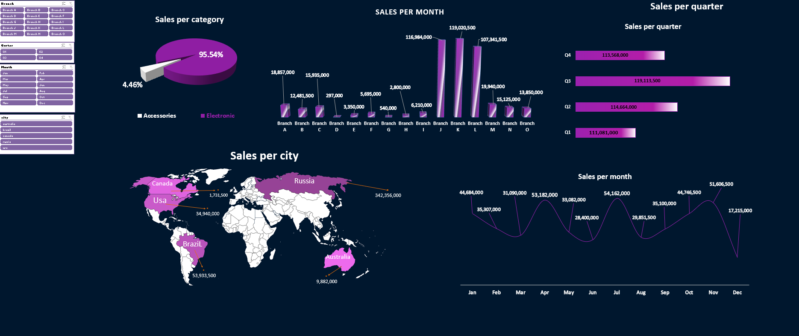

# [project : company sales using only Excel ](https://github.com/mo0Raslan/excel-sales)
in this project i used a dataset from kaggle and cleaned it and made some pivot tables 
wrote the insihts and started to choose the appropriate charts
and added a slicer to filter data
## overview of the dashboard

